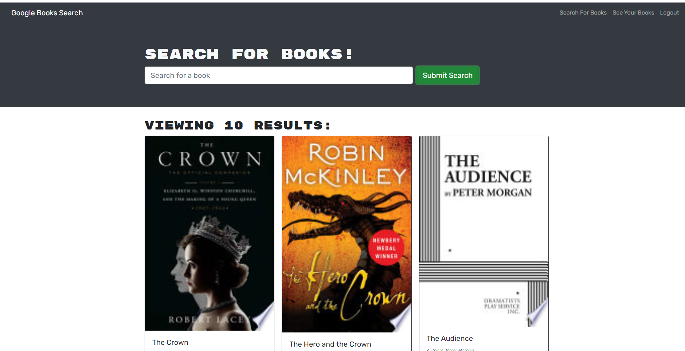

# book-searcher

## Description: 
Good book suggestions can be hard to come by, but with this handy book searcher web app its easy to find something you'd be interested in by simply searching for a genre or topic that appeals to you. create a profile and you will be able to add and remove books from your list to remind you of your favorites!

 This site uses the google search api to serve all of the book data, and express/apollo to fetch that data.   

## Technologies used:

* Javascript
* Node.js
* HTML
* CSS
* Mongoose/MongoDB
* React
* Apollo

  

## Usage:
Checkout the deployed site at the link below!

https://quiet-reaches-65668.herokuapp.com/
  

## Preview:

## License:

This project is licensed under the MIT license.
  

## Questions:

If you have any questions about the repo, open an issue or contact me directly at Jespi116@fiu.edu. you can find more of my work at [Jespi116](https://github.com/Jespi116)
